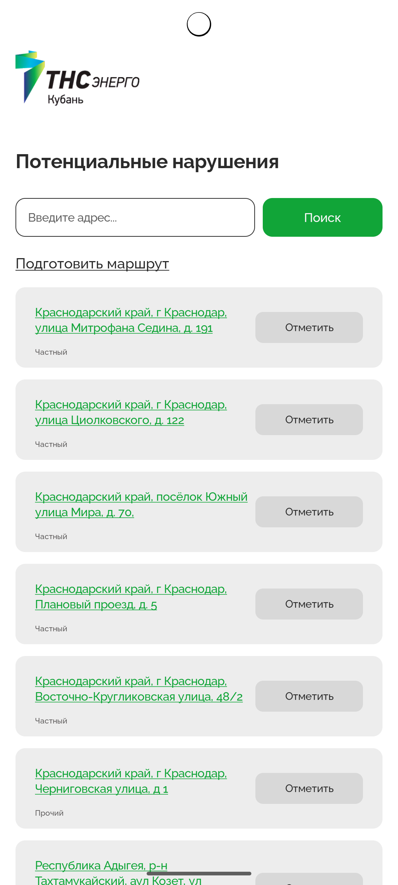
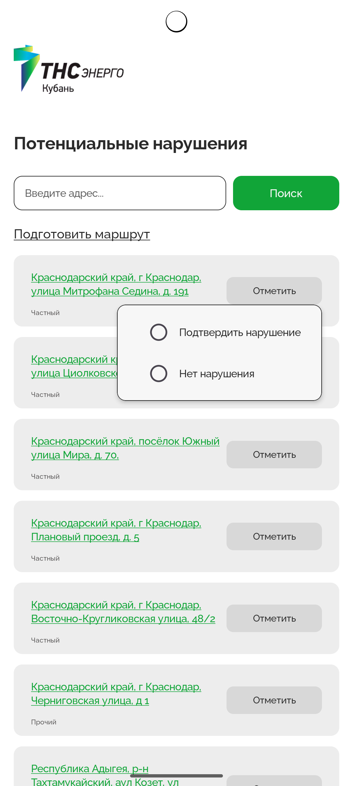
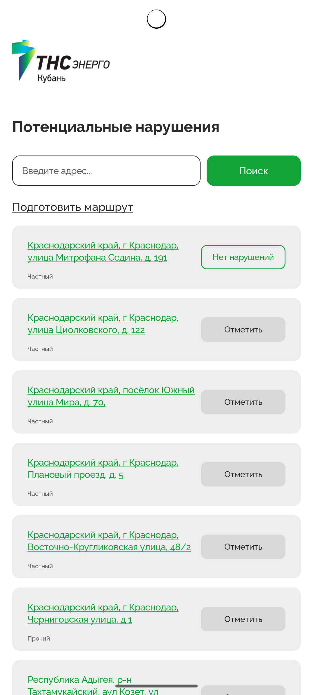
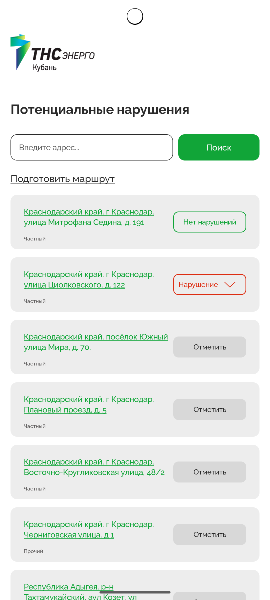
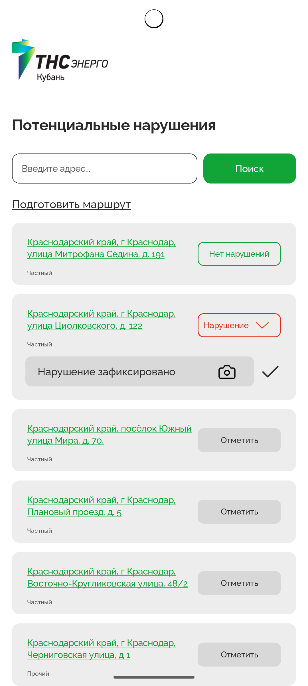
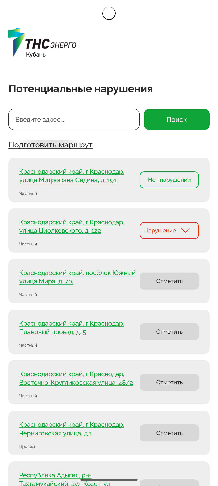
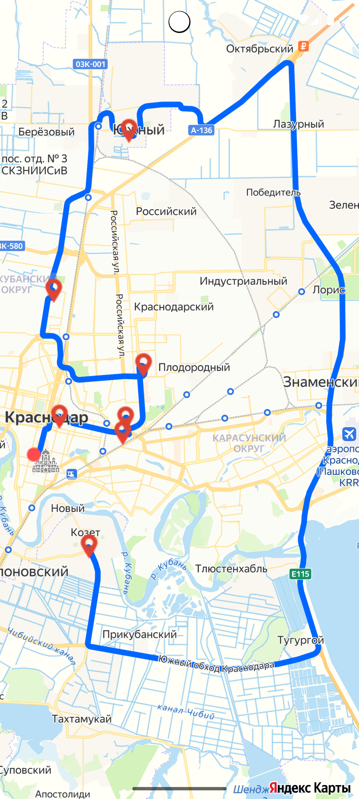

# Hackathon App

## Описание
Приложение демонстрирует работу с картами на базе **Jetpack Compose** и **Yandex Maps API**. С помощью приложения вы можете:
- Посмотреть на карте точки потенциальных нарушений
- Отсортировать и искать адреса
- Прокладывать маршрут от текущей геопозиции через все точки до самой удалённой
- Отмечать статус проверенных точек

## Технологии
- **Jetpack Compose** — современный декларативный UI для Android.
- **Yandex Maps API** — для отображения карт и построения маршрутов (см. [условия использования](https://yandex.ru/legal/maps_api/)).
- **Hilt** — для внедрения зависимостей.
- **Retrofit + Gson** — для сетевого взаимодействия с API.
- **Play Services Location** — для получения геопозиции пользователя.

## Установка
1. Клонируйте репозиторий:
   ```bash
   git clone https://github.com/yourusername/hackathon-app.git
   ```
2. В файле local.properties добавьте ключ MapKit:
MAPKIT_API_KEY=ваш_ключ

3. Откройте проект в Android Studio и выполните сборку.








